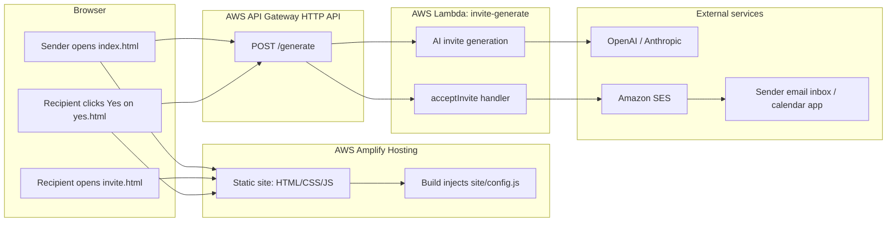

# Date Invite — Serverless AI App

A playful invite generator hosted as a static site on AWS Amplify, with an AWS Lambda backend for AI generation and calendar-invite emails.

## Project Structure

```text
invite_Claude-exercise/
├── site/                  # Static frontend
│   ├── index.html         # Invite generator form
│   ├── invite.html        # Recipient's shareable invite page
│   ├── yes.html           # Celebration page after "Yes!"
│   ├── styles.css         # Responsive CSS
│   ├── app.js             # Frontend logic
│   └── config.js          # API URL config, injected by Amplify
├── lambda/
│   ├── generate.js        # AI generation + SES calendar invite backend
│   └── package.json
├── amplify.yml            # Amplify static-site build spec
└── README.md
```

## Architecture



## How The App Works

1. The sender fills in their email, recipient name, activity, date, and optional note.
2. The frontend sends an `invite` request to API Gateway.
3. API Gateway invokes Lambda.
4. Lambda uses OpenAI first, then falls back to Claude if needed.
5. The frontend generates a shareable `/invite.html?...` URL containing the invite details.
6. The recipient opens the invite and clicks **Yes!**.
7. `/yes.html` sends an `acceptInvite` request to Lambda.
8. Lambda sends the sender an `.ics` calendar invite email through Amazon SES.

## AWS Services In This Project

### What Is AWS Amplify?

AWS Amplify Hosting is used here as a static web host and Git-based deployment target. It watches the connected GitHub branch, runs `amplify.yml`, and publishes the files in `site/`.

In this project, Amplify does **not** manage the Lambda backend. It only builds and hosts the frontend.

### What Is API Gateway?

Amazon API Gateway is the public HTTP entry point for the backend. Browsers cannot safely call Lambda directly, so API Gateway provides a URL such as:

```text
https://abc123.execute-api.ap-northeast-1.amazonaws.com/generate
```

API Gateway receives HTTPS requests from the frontend and invokes the Lambda function behind it.

### Why Use API Gateway?

API Gateway gives the frontend a stable public API URL while Lambda stays behind an AWS-managed HTTP integration. It also handles HTTP routing, CORS preflight requests, and request forwarding to Lambda.

For this app:

```text
Frontend fetch() -> API Gateway POST /generate -> Lambda invite-generate
```

## Deployment

This project currently has two separate deployment paths:

```text
Git push -> Amplify deploys site/
Manual Lambda upload -> AWS Lambda deploys lambda/
```

This is important: changing files in `lambda/` and pushing to GitHub does **not** automatically update the live Lambda function unless a separate backend deployment pipeline is added.

### Frontend: Amplify Deployment

Amplify is configured by `amplify.yml`:

```yaml
artifacts:
  baseDirectory: site
  files:
    - '**/*'
```

Every push to the connected branch redeploys the static frontend from `site/`.

Amplify also injects the API Gateway URL into `site/config.js` during build:

```yaml
- "echo \"window.CONFIG = { apiUrl: '${API_GATEWAY_URL}' };\" > site/config.js"
```

Required Amplify environment variable:

```text
API_GATEWAY_URL=https://your-api-id.execute-api.ap-northeast-1.amazonaws.com
```

### Backend: Lambda Deployment

Deploy Lambda manually after changing files in `lambda/`:

```bash
cd lambda
npm install
zip -r ../lambda.zip .
aws lambda update-function-code \
  --function-name invite-generate \
  --region ap-northeast-1 \
  --zip-file fileb://../lambda.zip
aws lambda wait function-updated \
  --function-name invite-generate \
  --region ap-northeast-1
```

The wait command matters because AWS may accept the upload before the function is fully ready for new invocations.

## Lambda Environment Variables

Set these on the `invite-generate` Lambda function:

```text
ANTHROPIC_API_KEY=...
OPENAI_API_KEY=...
SES_FROM_EMAIL=invites@jaycloud.net
SES_REGION=ap-northeast-1
SES_CALENDAR_TIMEZONE=Europe/London
```

`SES_CALENDAR_TIMEZONE` is optional. The frontend also passes the sender's browser timezone when generating an invite.

## SES Calendar Invite Procedure

1. Open Amazon SES in `ap-northeast-1`.
2. Verify the domain `jaycloud.net`.
3. Confirm DKIM is successful for the domain.
4. Use a sender address under that verified domain, for example:

   ```text
   invites@jaycloud.net
   ```

5. Request SES production access in `ap-northeast-1`.
6. Confirm production access:

   ```bash
   aws sesv2 get-account --region ap-northeast-1
   ```

   Expected:

   ```json
   "ProductionAccessEnabled": true
   ```

7. Add SES permission to the Lambda execution role:

   ```json
   {
     "Version": "2012-10-17",
     "Statement": [
       {
         "Effect": "Allow",
         "Action": "ses:SendRawEmail",
         "Resource": "*"
       }
     ]
   }
   ```

8. Set Lambda environment variables:

   ```text
   SES_FROM_EMAIL=invites@jaycloud.net
   SES_REGION=ap-northeast-1
   ```

When the recipient clicks **Yes!**, Lambda sends a raw MIME email with a `text/calendar` `.ics` attachment. Calendar apps such as Google Calendar and Outlook can recognize the attachment as an event invite.

## API Gateway Setup

1. Create an HTTP API in API Gateway.
2. Add Lambda integration for `invite-generate`.
3. Add route:

   ```text
   POST /generate
   ```

4. Deploy the API.
5. Copy the invoke URL.
6. Add it to Amplify as `API_GATEWAY_URL`.

The frontend calls:

```js
fetch(`${API_URL}/generate`, ...)
```

## Local Development

Set `apiUrl` in `site/config.js` to your API Gateway URL, then serve the static site:

```bash
npx serve site
```

Or use Python:

```bash
cd site
python3 -m http.server 4173
```

Open:

```text
http://127.0.0.1:4173
```

## Troubleshooting

### Yes Page Says Calendar Invite Is Unavailable In Local Preview

`yes.html` could not find `window.CONFIG.apiUrl`. Confirm `site/config.js` exists and is loaded before `app.js`.

### Yes Page Says Could Not Send Calendar Invite

Check Lambda logs:

```bash
aws logs tail /aws/lambda/invite-generate \
  --region ap-northeast-1 \
  --since 10m \
  --format short
```

### Frontend Changed But Lambda Behavior Did Not

Amplify only deploys `site/`. Redeploy Lambda manually with `update-function-code`.

### Lambda Changed But Frontend Behavior Did Not

Confirm Amplify finished deploying the latest Git commit, then hard-refresh the browser or use a newly generated invite link.
